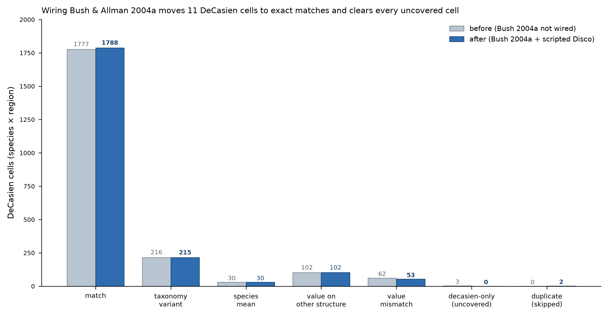

# DeCasien → volumes_merged ingestion — coverage report

_Generated after wiring Bush & Allman 2004a into the canonical merge, scripting the Disco
cross-genus reclassification, and adding the DeCasien Tier-2 gap-fill mechanism._

## Headline

- Every DeCasien brain-region cell now has a determinate status: **`decasien_only` (uncovered) = 0** (was 3).
- Wiring one primary (Bush & Allman 2004a, PNAS frontal/neocortex table) moved **11 cells to exact
  0.0 % matches** and cleared **9 spurious value-mismatches**.
- The two Disco/GPZ-5542 cross-genus duplicate cells are reclassified by script (survive regeneration).
- The DeCasien Tier-2 gap-fill team currently ingests **0 cells** — every DeCasien value is either
  covered by a primary or is the excluded Disco duplicate. The mechanism is wired and tested for
  future DeCasien versions.

## Status counts, before vs after

| status | before | after | Δ |
|---|--:|--:|--:|
| match | 1777 | 1788 | +11 |
| taxonomy_variant | 216 | 215 | -1 |
| species_mean | 30 | 30 | 0 |
| value_match_other_structure | 102 | 102 | 0 |
| description_match_value_mismatch | 62 | 53 | -9 |
| decasien_only (uncovered) | 3 | 0 | -3 |
| decasien_duplicate_of_Hylobates_lar_Disco (skipped) | 0 | 2 | +2 |
| **total** | **2190** | **2190** | 0 |

## Cells newly resolved (13)

All resolved to **0.0 % exact matches**. The two targeted residual rows (Cheirogaleus GM, Mandrillus
GM+WM) plus 9 further Bush-2004a cells (Daubentonia, Propithecus, Tarsius, Cheirogaleus/Mandrillus
whole-brain) that had been `description_match_value_mismatch`, plus the 2 Disco duplicates.

| taxon | region | value | before → after | source |
|---|---|--:|---|---|
| Cheirogaleus_medius | BV | 2630 | description_match_value_mismatch → match | Bush_Allman_2004_a_Table2 |
| Cheirogaleus_medius | Neocortex (GM+WM) | 1020 | description_match_value_mismatch → match | Bush_Allman_2004_a_Table2 |
| Cheirogaleus_medius | Neocortex (GM) | 890 | decasien_only → match | Bush_Allman_2004_a_Table2 |
| Daubentonia_madagascariensis | BV | 41070 | description_match_value_mismatch → match | Bush_Allman_2004_a_Table2 |
| Daubentonia_madagascariensis | Neocortex (GM+WM) | 24070 | description_match_value_mismatch → match | Bush_Allman_2004_a_Table2 |
| Daubentonia_madagascariensis | Neocortex (GM) | 19790 | description_match_value_mismatch → match | Bush_Allman_2004_a_Table2 |
| Mandrillus_sphinx | BV | 127610 | description_match_value_mismatch → match | Bush_Allman_2004_a_Table2 |
| Mandrillus_sphinx | Neocortex (GM+WM) | 99260 | decasien_only → match | Bush_Allman_2004_a_Table2 |
| Nomascus_concolor | BV | 115800 | decasien_only → decasien_duplicate_of_Hylobates_lar_Disco | deSousa_etal_2010_Table1 |
| Nomascus_concolor | Amygdala | 637 | description_match_value_mismatch → decasien_duplicate_of_Hylobates_lar_Disco | Barger2007_specimen |
| Propithecus_verreauxi | Neocortex (GM+WM) | 12190 | description_match_value_mismatch → match | Bush_Allman_2004_a_Table2 |
| Tarsius_syrichta | BV | 3060 | description_match_value_mismatch → match | Bush_Allman_2004_a_Table2 |
| Tarsius_syrichta | Neocortex (GM+WM) | 1620 | match_taxonomy_variant → match | Bush_Allman_2004_a_Table2 |

## Provenance of the fix

- **Bush & Allman 2004a** (`Bush_Allman_2004_a_Table2`, DOI 10.1073/pnas.0305760101, Table 2): added
  to the canonical `papers` tribble (team `Bush`, 2004). Its `neocortex_grey`/`neocortex_white`
  columns are summed into a combined `Neocortex_Vol.mm3` (GM+WM) in the reshape, then all `_cm3`
  columns are converted ×1000. Data comes from `__Public/comparative-data/`, per the source-of-truth rule.
- **Disco / GPZ-5542**: DeCasien files one Zilles/INM-1 gibbon under two genus labels
  (`Nomascus_concolor` BV 115800 + Amygdala 637 vs the merge's `Hylobates lar`). Reclassified in the
  comparison script as `decasien_duplicate_of_Hylobates_lar_Disco`. See
  `____Collections and Specimen notes/Disco_gibbon_specimen_note.md`.

## Reproducibility

- Regenerated **offline** via the taxizedb NCBI-backbone cache (`volumes_species_ids_cache.csv`).
- Merge: 282 species × 127 variables from 39 tables. All 8 integrity checks pass
  (`DeCasien_ingestion_checks.csv`): no rows lost, all 100 changed values confined to
  neocortex/brain-volume variables, no DeCasien-team overlap with primaries, no match→mismatch regressions.